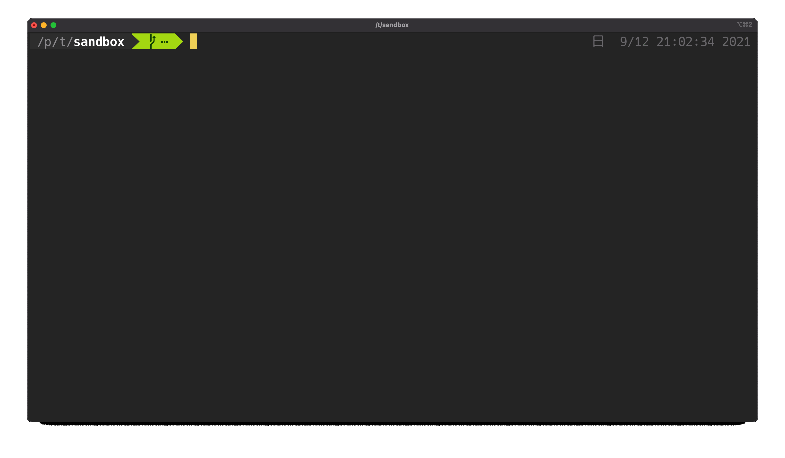

# Docker on Lima

Use Docker on LIma.



## Getting Started

### Prerequisites

```
brew install lima docker
```

### Installation

Copy `lima_with_docker.yaml` to the local environment.

```
curl -O https://raw.githubusercontent.com/matsukaz/docker-on-lima/main/lima_with_docker.yaml
```

Create lima instance using `lima_with_docker.yaml`

```sh
limactl start lima_with_docker.yaml
```

Set `DOCKER_HOST` to connect to the Docker daemon running on Lima.

```
export DOCKER_HOST=tcp://127.0.0.1:61123
```

Wait a few seconds for the Docker daemon to be installed and started on Lima.

```
$ docker ps
CONTAINER ID   IMAGE     COMMAND   CREATED   STATUS    PORTS     NAMES
```

## License

Apache License 2.0
